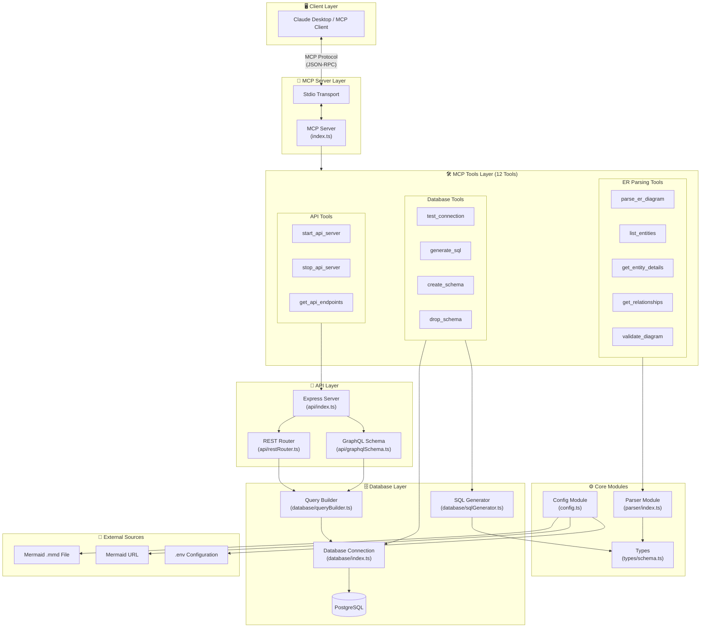
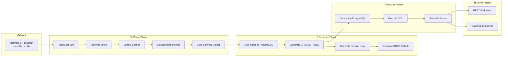
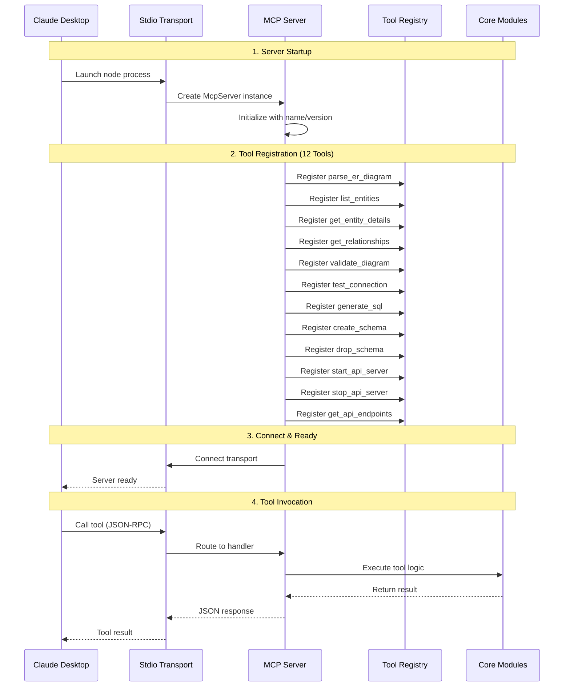
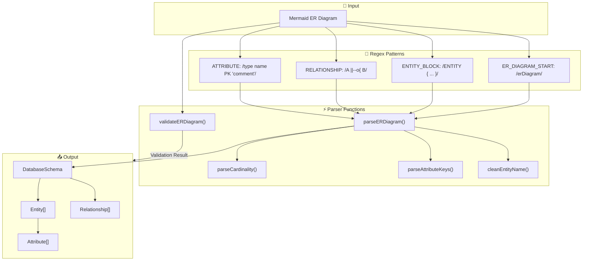
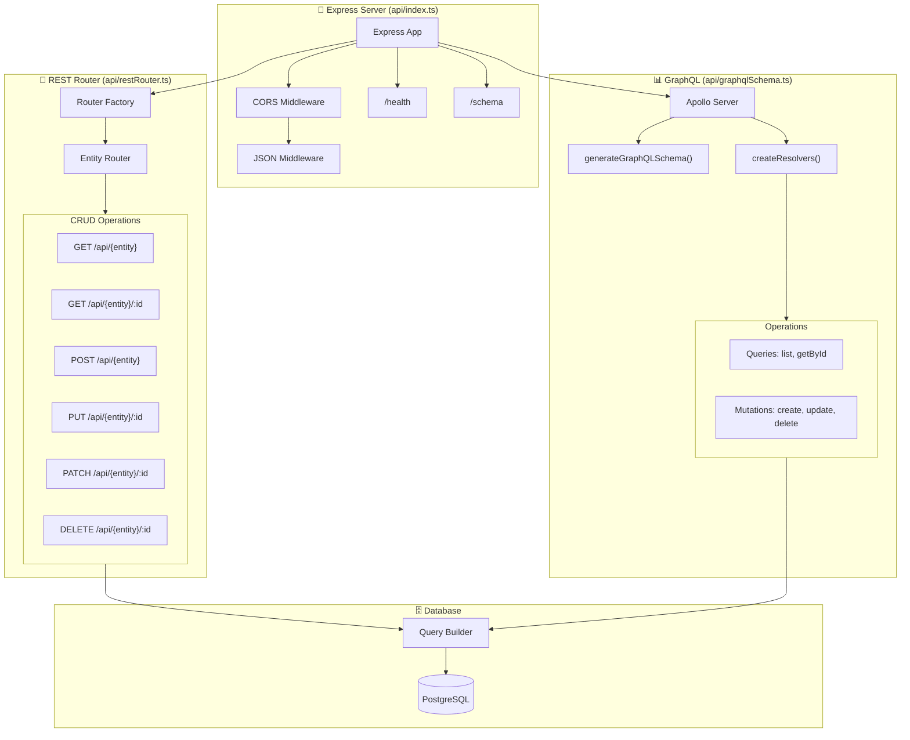
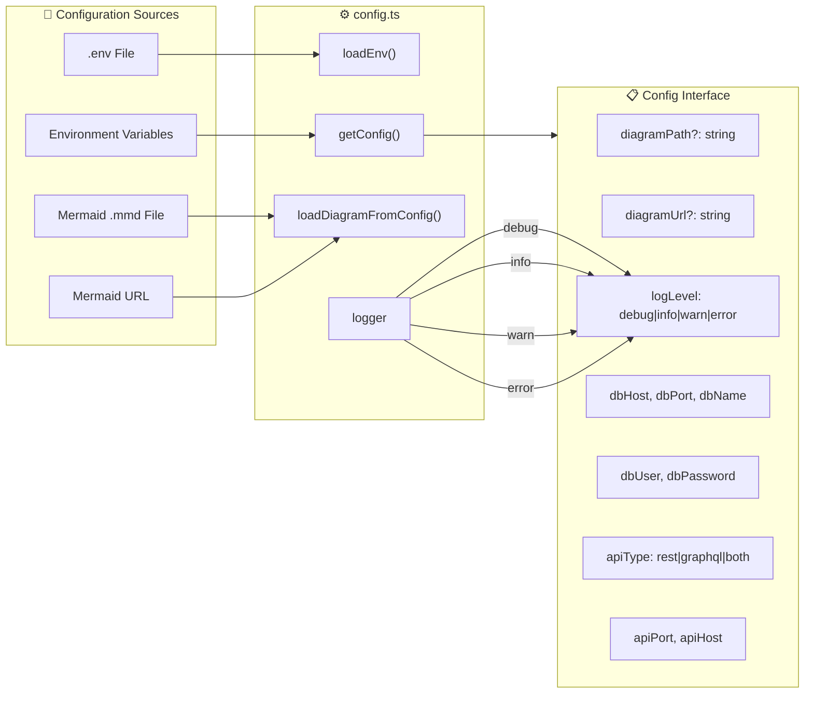
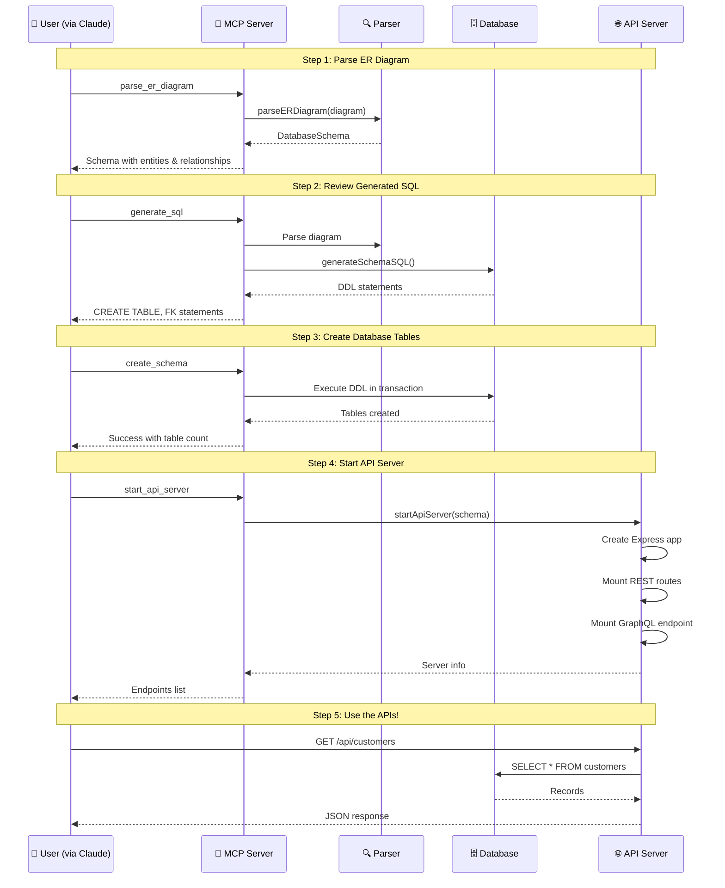

# MCP Mermaid ER Server - Architecture Documentation

> **Complete end-to-end architecture overview** of the Model Context Protocol (MCP) server that parses Mermaid ER diagrams, creates PostgreSQL database tables, and exposes automatic REST/GraphQL CRUD APIs.

---

## 📊 High-Level System Architecture



---

## 🔄 Complete Data Flow Architecture



---

## 📁 Project Structure

```
mcp-tools/
├── src/
│   ├── index.ts              # 🚀 MCP Server Entry Point
│   ├── config.ts             # ⚙️ Environment Configuration
│   ├── test.ts               # 🧪 Test Runner
│   │
│   ├── types/
│   │   └── schema.ts         # 📋 TypeScript Interfaces
│   │
│   ├── parser/
│   │   └── index.ts          # 🔍 Mermaid ER Parser
│   │
│   ├── database/
│   │   ├── index.ts          # 🗄️ PostgreSQL Connection Pool
│   │   ├── sqlGenerator.ts   # ⚡ DDL SQL Generator
│   │   └── queryBuilder.ts   # 🔧 CRUD Query Builder
│   │
│   ├── api/
│   │   ├── index.ts          # 🌐 Express Server Manager
│   │   ├── restRouter.ts     # 📡 REST CRUD Router
│   │   └── graphqlSchema.ts  # 📊 GraphQL Schema Generator
│   │
│   └── tools/
│       ├── erTools.ts        # 🛠️ ER Diagram MCP Tools (5)
│       └── dbTools.ts        # 🛠️ Database & API MCP Tools (7)
│
├── examples/
│   └── sample-er.mmd         # 📄 Example ER Diagram
│
├── dist/                     # 📦 Compiled JavaScript
├── .env                      # 🔐 Environment Variables
├── .env.example              # 📝 Environment Template
├── package.json              # 📦 Dependencies
└── tsconfig.json             # ⚙️ TypeScript Config
```

---

## 🔌 MCP Server Creation Flow



---

## 🛠️ MCP Tools Reference

### Parsing Tools (5 Tools)

| Tool | Description | Input | Output |
|------|-------------|-------|--------|
| `parse_er_diagram` | Parse complete ER diagram | `diagram?: string` | Full schema with entities & relationships |
| `list_entities` | List all entity names | `diagram?: string` | Array of entity names with aliases |
| `get_entity_details` | Get entity attributes | `entityName: string, diagram?: string` | Entity with all attributes, types, keys |
| `get_relationships` | Get all relationships | `diagram?: string, entityName?: string` | Relationships with cardinalities |
| `validate_diagram` | Validate diagram syntax | `diagram: string` | `{valid: boolean, errors: string[]}` |

### Database Tools (4 Tools)

| Tool | Description | Input | Output |
|------|-------------|-------|--------|
| `test_connection` | Test PostgreSQL connection | None | `{success: boolean, error?: string}` |
| `generate_sql` | Generate DDL without executing | `diagram?: string` | SQL statements (CREATE, FK, DROP) |
| `create_schema` | Create tables in database | `diagram?: string, dropExisting?: boolean` | Created tables count |
| `drop_schema` | Drop all tables (destructive) | `diagram?: string, confirm: boolean` | Dropped tables count |

### API Tools (3 Tools)

| Tool | Description | Input | Output |
|------|-------------|-------|--------|
| `start_api_server` | Start REST/GraphQL server | `diagram?: string` | Server info with endpoints |
| `stop_api_server` | Stop the API server | None | `{stopped: boolean}` |
| `get_api_endpoints` | Get running server info | None | Endpoints list, GraphQL URL |

---

## 🔍 Parser Module Architecture



### Type Definitions

```typescript
// Entity structure
interface Entity {
    name: string;
    alias?: string;
    attributes: Attribute[];
}

// Attribute structure  
interface Attribute {
    name: string;
    type: string;
    keys: ('PK' | 'FK' | 'UK')[];
    comment?: string;
}

// Relationship structure
interface Relationship {
    firstEntity: string;
    secondEntity: string;
    firstCardinality: Cardinality;
    secondCardinality: Cardinality;
    identifying: boolean;
    label: string;
}

// Cardinality types
type Cardinality = 
    | 'ZERO_OR_ONE'    // |o or o|
    | 'EXACTLY_ONE'    // ||
    | 'ZERO_OR_MORE'   // }o or o{
    | 'ONE_OR_MORE';   // }| or |{
```

---

## 🗄️ Database Layer Architecture

```mermaid
flowchart TB
    subgraph Schema["📋 Input Schema"]
        DS["DatabaseSchema"]
    end
    
    subgraph SQLGen["⚡ SQL Generator (sqlGenerator.ts)"]
        direction TB
        TM["Type Mapping<br/>(Mermaid → PostgreSQL)"]
        TN["Table Naming<br/>(snake_case)"]
        CT["generateCreateTable()"]
        FK["generateForeignKeys()"]
        DT["generateDropTables()"]
        FS["generateSchemaSQL()"]
    end
    
    subgraph Connection["🔌 Database Connection (index.ts)"]
        Pool["Connection Pool<br/>(max: 20 connections)"]
        Query["query()"]
        TX["transaction()"]
        Test["testConnection()"]
    end
    
    subgraph QueryBuilder["🔧 Query Builder (queryBuilder.ts)"]
        CRUD["createCrudQueries()"]
        Select["selectAll() / selectById()"]
        Insert["insert()"]
        Update["update()"]
        Delete["delete()"]
        Count["count()"]
    end
    
    subgraph Output["🗄️ PostgreSQL"]
        PG[(PostgreSQL Database)]
    end
    
    DS --> TM --> CT
    DS --> TN --> CT
    CT --> FK --> FS
    CT --> DT
    
    FS --> Query --> Pool --> PG
    TX --> Pool
    Test --> Pool
    
    DS --> CRUD
    CRUD --> Select
    CRUD --> Insert
    CRUD --> Update
    CRUD --> Delete
    CRUD --> Count
    
    Select --> Query
    Insert --> Query
    Update --> Query
    Delete --> Query
```



### SQL Type Mapping

| Mermaid Type | PostgreSQL Type |
|--------------|-----------------|
| `int`, `integer` | `INTEGER` |
| `bigint` | `BIGINT` |
| `serial` | `SERIAL` |
| `string`, `varchar` | `VARCHAR(255)` |
| `text` | `TEXT` |
| `boolean`, `bool` | `BOOLEAN` |
| `date` | `DATE` |
| `datetime`, `timestamp` | `TIMESTAMP` |
| `uuid` | `UUID` |
| `json`, `jsonb` | `JSON` / `JSONB` |
| `float`, `decimal` | `FLOAT` / `DECIMAL(10,2)` |

---

## 🌐 API Layer Architecture



### REST API Endpoints (Auto-Generated)

For each entity in your ER diagram, the following endpoints are created:

```
┌─────────────────────────────────────────────────────────────┐
│  REST API Endpoints (per entity)                            │
├──────────────────┬──────────────────────────────────────────┤
│ GET    /api/{e}  │ List all records (with pagination)       │
│ GET    /api/{e}/:id │ Get single record by ID               │
│ POST   /api/{e}  │ Create new record                        │
│ PUT    /api/{e}/:id │ Full update record                    │
│ PATCH  /api/{e}/:id │ Partial update record                 │
│ DELETE /api/{e}/:id │ Delete record                         │
└──────────────────┴──────────────────────────────────────────┘
```

### GraphQL Schema (Auto-Generated)

```graphql
# For each entity, these are generated:
type Customer {
  customer_id: Int!
  email: String
  name: String
}

input CustomerInput {
  email: String
  name: String
}

type Query {
  customers(limit: Int, offset: Int): [Customer!]!
  customer(id: ID!): Customer
}

type Mutation {
  createCustomer(input: CustomerInput!): Customer!
  updateCustomer(id: ID!, input: CustomerInput!): Customer
  deleteCustomer(id: ID!): Customer
}
```

---

## ⚙️ Configuration Architecture



### Environment Variables

| Variable | Description | Default |
|----------|-------------|---------|
| `MERMAID_DIAGRAM_PATH` | Path to .mmd file | - |
| `MERMAID_DIAGRAM_URL` | URL to fetch diagram | - |
| `LOG_LEVEL` | Logging level | `info` |
| `DB_HOST` | PostgreSQL host | - |
| `DB_PORT` | PostgreSQL port | `5432` |
| `DB_NAME` | Database name | - |
| `DB_USER` | Database user | - |
| `DB_PASSWORD` | Database password | - |
| `API_TYPE` | API type (rest/graphql/both) | `rest` |
| `API_PORT` | API server port | `3000` |
| `API_HOST` | API server host | `0.0.0.0` |

---

## 🚀 Complete Workflow Example



---

## 🔐 Security Considerations

1. **Database Credentials**: Store in `.env`, never commit to git
2. **CORS**: Enabled by default, configure for production
3. **Input Validation**: Zod schemas validate all MCP tool inputs
4. **SQL Injection**: Parameterized queries used throughout
5. **Drop Protection**: `drop_schema` requires explicit `confirm: true`

---

## 📚 Dependencies

| Package | Purpose |
|---------|---------|
| `@modelcontextprotocol/sdk` | MCP server implementation |
| `express` | HTTP server framework |
| `@apollo/server` | GraphQL server |
| `pg` | PostgreSQL client |
| `zod` | Input validation |
| `cors` | CORS middleware |
| `dotenv` | Environment configuration |
| `typescript` | Type safety |

---

## 🎯 Quick Start

```bash
# 1. Install dependencies
npm install

# 2. Configure environment
cp .env.example .env
# Edit .env with your settings

# 3. Build the server
npm run build

# 4. Add to Claude Desktop config
# See README.md for claude_desktop_config.json setup

# 5. Use via Claude Desktop
# "Parse my ER diagram"
# "Create the database tables"
# "Start the API server"
```

---

*Generated for MCP Mermaid ER Server v2.0.0*
