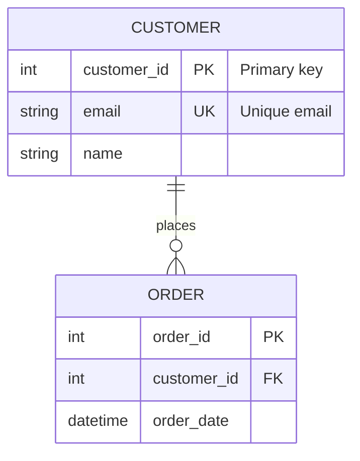

# MCP Mermaid ER Server

An open-source **Model Context Protocol (MCP)** server that parses **Mermaid ER diagrams**, creates **PostgreSQL database tables**, and exposes automatic **REST/GraphQL CRUD APIs**.


## Features

- 🔍 **Parse Mermaid ER Diagrams** - Extract entities, attributes, and relationships
- 🗄️ **Auto-Create PostgreSQL Tables** - Generate DDL and execute against your database
- 🚀 **REST API Generation** - Automatic CRUD endpoints for all entities
- 📊 **GraphQL API Generation** - Type-safe queries and mutations
- 🔑 **Key Detection** - Identifies PK, FK, and UK constraints
- ⚙️ **Configurable** - Environment variables for database and API settings

## Installation

```bash
git clone https://github.com/yourusername/mcp-mermaid-er-server.git
cd mcp-mermaid-er-server
npm install
npm run build
```

## Configuration

Create a `.env` file (copy from `.env.example`):

```env
# Mermaid Source
MERMAID_DIAGRAM_PATH=./examples/sample-er.mmd

# Database (PostgreSQL)
DB_HOST=localhost
DB_PORT=5432
DB_NAME=mydb
DB_USER=postgres
DB_PASSWORD=password

# API Server
API_TYPE=rest       # rest, graphql, or both
API_PORT=3000
API_HOST=0.0.0.0
```

## Claude Desktop Integration

Add to `claude_desktop_config.json`:

```json
{
  "mcpServers": {
    "mermaid-er": {
      "command": "node",
      "args": ["/path/to/mcp-tools/dist/index.js"],
      "env": {
        "MERMAID_DIAGRAM_PATH": "/path/to/your/diagram.mmd",
        "DB_HOST": "localhost",
        "DB_NAME": "mydb",
        "DB_USER": "postgres",
        "DB_PASSWORD": "password"
      }
    }
  }
}
```

## Available MCP Tools (12 Total)

### Parsing Tools
| Tool | Description |
|------|-------------|
| `parse_er_diagram` | Parse ER diagram, return full schema |
| `list_entities` | List all entity names |
| `get_entity_details` | Get attributes for an entity |
| `get_relationships` | Get all relationships |
| `validate_diagram` | Validate diagram syntax |

### Database Tools
| Tool | Description |
|------|-------------|
| `test_connection` | Test PostgreSQL connection |
| `generate_sql` | Generate DDL without executing |
| `create_schema` | Create tables in database |
| `drop_schema` | Drop all tables (requires confirmation) |

### API Tools
| Tool | Description |
|------|-------------|
| `start_api_server` | Start REST/GraphQL server |
| `stop_api_server` | Stop the API server |
| `get_api_endpoints` | List all endpoints |

## Workflow Example

1. **Parse your ER diagram** → `parse_er_diagram`
2. **Review the SQL** → `generate_sql`
3. **Create database tables** → `create_schema`
4. **Start the API server** → `start_api_server`
5. **Use the auto-generated endpoints!**

## API Endpoints

### REST (when `API_TYPE=rest` or `both`)
```
GET    /api/{entity}       - List all records
GET    /api/{entity}/:id   - Get by ID
POST   /api/{entity}       - Create record
PUT    /api/{entity}/:id   - Update record
DELETE /api/{entity}/:id   - Delete record
```

### GraphQL (when `API_TYPE=graphql` or `both`)
```graphql
# Queries
query { customers { customer_id email } }
query { customer(id: "1") { email } }

# Mutations
mutation { createCustomer(input: { email: "test@example.com" }) { customer_id } }
mutation { updateCustomer(id: "1", input: { email: "new@example.com" }) { email } }
mutation { deleteCustomer(id: "1") { customer_id } }
```

## Supported ER Syntax



## Development

```bash
npm run dev      # Run with ts-node
npm run build    # Compile TypeScript
npm test         # Run tests
```

## License

MIT License - see [LICENSE](LICENSE)
