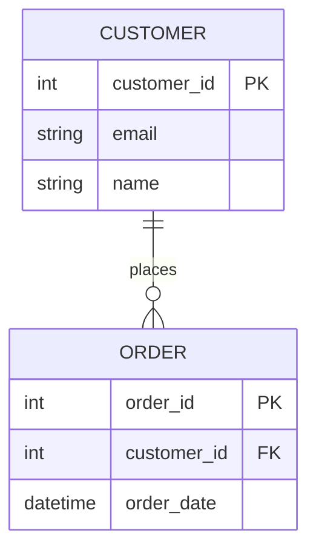
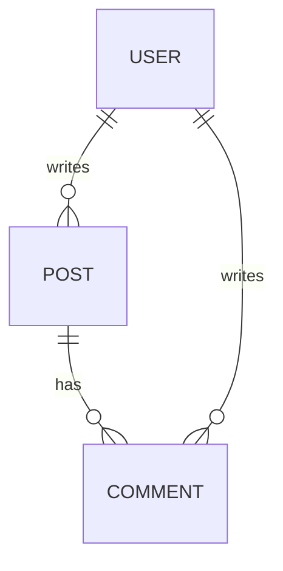

# Why Use MCP Mermaid ER Server?

> **TL;DR**: Draw a diagram → Get a working database + API. It's that simple.

---

## 😫 The Problem

Building a backend for any application typically requires:

1. **Designing the database** - Writing SQL CREATE TABLE statements manually
2. **Setting up the database** - Configuring PostgreSQL, creating tables
3. **Building CRUD APIs** - Writing repetitive code for Create, Read, Update, Delete
4. **Adding GraphQL** - Even more boilerplate code
5. **Keeping everything in sync** - Schema changes = update everywhere

**This takes hours or days**, even for simple apps.

```
Traditional Approach:
┌─────────────────────────────────────────────────────────────┐
│ 📝 Write SQL         →  🗄️ Create DB       →  🔧 Build APIs │
│ (30+ min)               (20+ min)              (2+ hours)   │
└─────────────────────────────────────────────────────────────┘
                    Total: 3+ hours minimum
```

---

## ✨ The Solution

**Draw your data model as a diagram. Let AI do the rest.**

```
With MCP Mermaid ER Server:
┌─────────────────────────────────────────────────────────────┐
│ 📊 Draw Diagram  →  🤖 AI Creates Everything  →  🚀 Done!   │
│ (5 min)              (30 seconds)                            │
└─────────────────────────────────────────────────────────────┘
                    Total: 5 minutes
```

---

## 🎯 How It Works (In Plain English)

### Step 1: Draw Your Data Model

Just write a simple diagram like this:



### Step 2: Tell Claude What You Want

Just chat naturally:

> "Parse my ER diagram and create the database tables"

> "Start the API server"

### Step 3: Use Your New API! 

**That's it!** You now have:

- ✅ PostgreSQL tables with proper constraints
- ✅ REST API endpoints for all your entities
- ✅ GraphQL API for type-safe queries
- ✅ Full CRUD operations (Create, Read, Update, Delete)

---

## 🤔 Why Is This Useful?

### 1. **Speed** ⚡
What used to take hours now takes minutes. Perfect for:
- Rapid prototyping
- Hackathons
- MVPs (Minimum Viable Products)
- Testing ideas quickly

### 2. **No Boilerplate** 🚫
Stop writing the same CRUD code over and over. Focus on what makes your app unique.

### 3. **Visual First** 👁️
Diagrams are easier to understand than code. Your entire data model is visible at a glance.

### 4. **AI-Powered** 🤖
Works directly with Claude Desktop. Just describe what you want in plain English.

### 5. **Standards Compliant** ✓
- Uses standard PostgreSQL
- RESTful API best practices
- GraphQL specification
- Mermaid diagram syntax (widely supported)

---

## 💡 Real-World Examples

### Example 1: E-Commerce Backend

**Without this tool:**
- Write 5+ CREATE TABLE statements
- Build 30+ API endpoints
- Configure relationships, foreign keys
- Handle pagination, filtering
- Time: **1-2 days**

**With this tool:**
- Draw the ER diagram
- Say "Create the schema and start the API"
- Time: **10 minutes**

### Example 2: Blog Platform



Three entities, complex relationships → Full API in seconds.

### Example 3: Inventory System

Just draw your Products, Categories, Suppliers, Orders → Instant backend.

---

## 🆚 Comparison

| Approach | Time | Effort | Flexibility |
|----------|------|--------|-------------|
| Write everything manually | Days | High | Full control |
| Use an ORM + framework | Hours | Medium | Good |
| Low-code platforms | Hours | Low | Limited |
| **This MCP Server** | **Minutes** | **Very Low** | **Good** |

---

## 👥 Who Should Use This?

- **Developers** who want to prototype quickly
- **Startups** building MVPs fast
- **Students** learning about databases and APIs
- **Hackathon participants** racing against time
- **Anyone** who values their time

---

## 🚀 Getting Started

### 1. Set Up Once

```bash
# Clone and build
git clone <repo-url>
cd mcp-tools
npm install && npm run build

# Configure
cp .env.example .env
# Edit .env with your PostgreSQL details
```

### 2. Add to Claude Desktop

Add to your `claude_desktop_config.json`:

```json
{
  "mcpServers": {
    "mermaid-er": {
      "command": "node",
      "args": ["/path/to/mcp-tools/dist/index.js"]
    }
  }
}
```

### 3. Start Chatting!

Open Claude Desktop and try:

- *"Parse my ER diagram at ./my-schema.mmd"*
- *"Show me the SQL that would be generated"*
- *"Create the database tables"*
- *"Start the REST API server"*
- *"What endpoints are available?"*

---

## 📊 The Big Picture

```
┌──────────────────────────────────────────────────────────────────┐
│                         YOUR APP                                  │
├──────────────────────────────────────────────────────────────────┤
│   Frontend (React, Vue, etc.)                                     │
│          │                                                        │
│          ▼                                                        │
│   ┌──────────────────────────────────────────┐                   │
│   │  REST API: GET /api/customers            │  ← Auto-generated │
│   │  GraphQL: query { customers { ... } }    │  ← by this tool!  │
│   └──────────────────────────────────────────┘                   │
│          │                                                        │
│          ▼                                                        │
│   ┌──────────────────────────────────────────┐                   │
│   │  PostgreSQL Database                      │  ← Tables created │
│   │  (Tables, FKs, Constraints)              │  ← automatically! │
│   └──────────────────────────────────────────┘                   │
├──────────────────────────────────────────────────────────────────┤
│   📊 Your Mermaid ER Diagram                                      │
│   (The single source of truth)                                    │
└──────────────────────────────────────────────────────────────────┘
```

---

## 🎁 What You Get

| Feature | Description |
|---------|-------------|
| **12 MCP Tools** | Parse, validate, create, manage your schema |
| **Auto REST API** | GET, POST, PUT, PATCH, DELETE for every entity |
| **Auto GraphQL** | Queries and mutations with type safety |
| **PostgreSQL Tables** | Proper data types, PKs, FKs, unique constraints |
| **Pagination** | Built-in limit/offset support |
| **Error Handling** | Proper HTTP status codes and messages |

---

## ❓ FAQ

**Q: Do I need to know SQL?**
> No! Just draw a diagram. SQL is generated for you.

**Q: Can I customize the generated code?**
> The APIs are dynamic and generated on-the-fly. For custom logic, you can use this as a starting point and extend.

**Q: What databases are supported?**
> Currently PostgreSQL. More may come in the future.

**Q: Is this production-ready?**
> It's great for prototypes and internal tools. For production, review the generated schema and add authentication.

**Q: Can I see the SQL before it runs?**
> Yes! Use `generate_sql` to preview without executing.

---

## 🏁 Summary

**Stop writing boilerplate. Start building.**

This tool bridges the gap between your ideas and a working backend:

1. **Draw** → Visual ER diagram
2. **Generate** → Database + APIs
3. **Build** → Focus on your actual product

*Your database diagram becomes your running application.*

---

<p align="center">
  <b>Built with ❤️ for developers who value their time</b>
</p>
